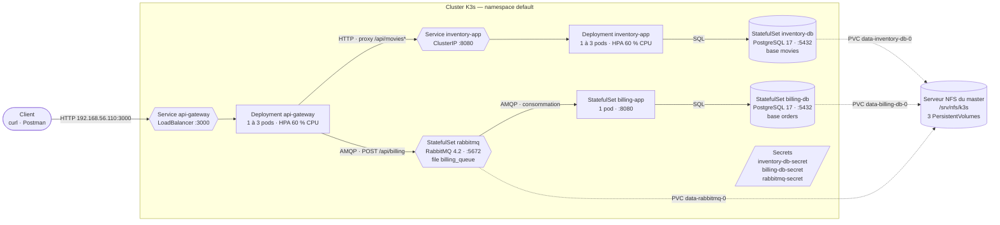
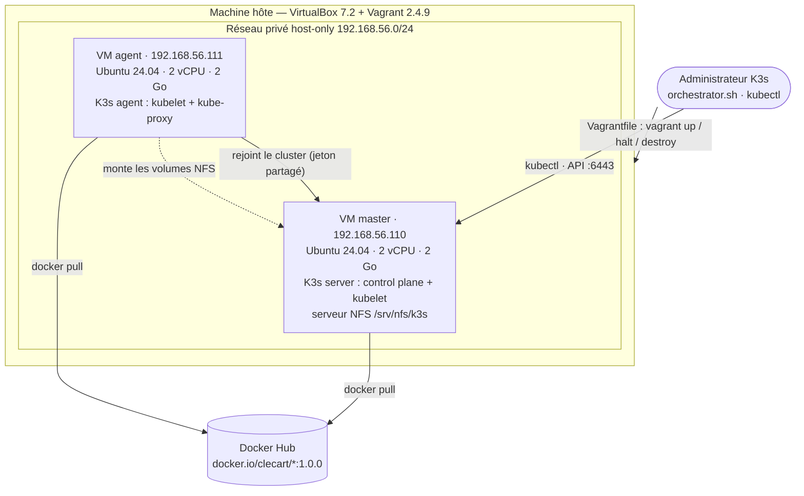

# orchestrator — Microservices sur Kubernetes (K3s)

**Auteur :** `clecart` — **Pile :** Vagrant 2.4.9 · VirtualBox 7.2 · Ubuntu 24.04 · K3s v1.36.4 · kubectl v1.36 · Docker Hub

Ce document est à la fois le **compte-rendu** du projet et sa **documentation
complète** : prérequis, configuration, installation, utilisation, scénario
d'audit, explication de chaque manifest, choix techniques, réponses aux
questions de la grille, composants de Kubernetes et dépannage. Les sorties
affichées ont été capturées sur le cluster réellement construit depuis ce dépôt.

> **Démarrage rapide** — prérequis : VirtualBox ≥ 7.0, Vagrant ≥ 2.4.9,
> kubectl, 4 Go de RAM libres ([§1](#1-prérequis)).
>
> ```bash
> git clone https://zone01normandie.org/git/clecart/orchestrator.git
> cd orchestrator
> ./orchestrator.sh create      # 2 VM + K3s + kubectl configuré + déploiement complet
> kubectl get nodes -A          # master et agent Ready
> ./orchestrator.sh test        # rejoue le scénario d'audit (14 vérifications)
> ```
>
> La passerelle répond alors sur <http://192.168.56.110:3000> (et sur
> `192.168.56.111:3000`). Arrêt : `./orchestrator.sh stop`, reprise :
> `./orchestrator.sh start`, suppression : `./orchestrator.sh destroy`.
> Révision express de l'audit : [REVISION-AUDIT.md](REVISION-AUDIT.md).

---

## Sommaire

0. [Vue d'ensemble](#0-vue-densemble)
1. [Prérequis](#1-prérequis)
2. [Configuration](#2-configuration)
3. [Installation et démarrage](#3-installation-et-démarrage)
4. [Utilisation : `orchestrator.sh` et kubectl](#4-utilisation--orchestratorsh-et-kubectl)
5. [API](#5-api)
6. [Scénario d'audit pas à pas](#6-scénario-daudit-pas-à-pas)
7. [Les manifests expliqués](#7-les-manifests-expliqués)
8. [Secrets](#8-secrets)
9. [Stockage persistant (NFS)](#9-stockage-persistant-nfs)
10. [Mise à l'échelle automatique (HPA)](#10-mise-à-léchelle-automatique-hpa)
11. [Le cluster : Vagrant + K3s](#11-le-cluster--vagrant--k3s)
12. [Images et Docker Hub](#12-images-et-docker-hub)
13. [Sécurité](#13-sécurité)
14. [Bonus réalisés](#14-bonus-réalisés)
15. [Dépannage](#15-dépannage)
16. [Arborescence du dépôt](#16-arborescence-du-dépôt)
17. [Questions d'audit — réponses types](#17-questions-daudit--réponses-types)
18. [Les composants de Kubernetes](#18-les-composants-de-kubernetes)
19. [Nettoyage](#19-nettoyage)
- [Sources](#sources)

---

## 0. Vue d'ensemble

### 0.1 Ce que fait le projet

Le sujet *orchestrator* reprend l'application en microservices de
*play-with-containers* — un catalogue de films (inventaire) et un service de
facturation, derrière une passerelle d'API unique, avec une file RabbitMQ entre
la passerelle et la facturation — et la déploie sur un **cluster Kubernetes**
au lieu de Docker Compose.

- Le cluster **K3s** compte deux machines virtuelles créées par **Vagrant** :
  `master` (serveur K3s) et `agent` (agent K3s).
- Chaque composant est décrit par un **manifest YAML** (infrastructure as code).
- Les images sont celles de ma solution *play-with-containers*, poussées sur
  **Docker Hub** (`docker.io/clecart/*`), d'où le cluster les tire.
- Les mots de passe vivent dans des **Secrets** Kubernetes, et nulle part
  ailleurs.
- La passerelle et l'inventaire sont des **Deployments** mis à l'échelle
  automatiquement (1 à 3 réplicas, seuil de 60 % de CPU). La facturation, les
  deux bases et RabbitMQ sont des **StatefulSets**.
- Les données des bases (et de la file) sont sur des **volumes persistants
  NFS** : un pod peut être replanifié sur l'autre nœud et retrouver ses données.
- Un seul script, **`orchestrator.sh`**, crée, démarre, arrête, déploie, teste
  et détruit l'ensemble.

### 0.2 Architecture applicative



La passerelle ne parle **jamais directement** à `billing-app` : une commande
`POST /api/billing/` est déposée dans la file RabbitMQ et la passerelle répond
`200` aussitôt. Si `billing-app` est arrêté, le message attend dans la file et
sera enregistré à son redémarrage — c'est ce que vérifie la fin de l'audit.

### 0.3 Architecture d'infrastructure



### 0.4 Correspondance avec le schéma du sujet

| Composant du sujet | Objet Kubernetes | Image Docker Hub | Port | Volume | Manifest |
|---|---|---|---|---|---|
| `api-gateway-app` | Deployment `api-gateway` + HPA + Service LoadBalancer | `clecart/api-gateway:1.0.0` | 3000 | — | `api-gateway.yaml` |
| `inventory-app` | Deployment `inventory-app` + HPA + Service ClusterIP | `clecart/inventory-app:1.0.0` | 8080 | — | `inventory-app.yaml` |
| `inventory-database` | StatefulSet `inventory-db` + Service headless | `clecart/inventory-database:1.0.0` | 5432 | `inventory-db-pv` (NFS) | `inventory-database.yaml` |
| `billing-app` | StatefulSet `billing-app` + Service headless | `clecart/billing-app:1.0.0` | 8080 | — | `billing-app.yaml` |
| `billing-database` | StatefulSet `billing-db` + Service headless | `clecart/billing-database:1.0.0` | 5432 | `billing-db-pv` (NFS) | `billing-database.yaml` |
| `RabbitMQ` | StatefulSet `rabbitmq` + Service headless + ConfigMap | `clecart/rabbitmq-server:1.0.0` | 5672 | `rabbitmq-pv` (NFS) | `rabbitmq.yaml` |
| Secrets | 3 Secrets `Opaque` | — | — | — | `secrets/*.yaml` (générés) |
| Volumes | StorageClass `nfs` + 3 PersistentVolumes | — | — | — | `storage.yaml` |

Les noms des StatefulSets de bases (`inventory-db`, `billing-db`) reprennent
ceux du dépôt de référence *play-with-containers* : le pod de la base de
facturation s'appelle donc exactement **`billing-db-0`**, comme dans la
commande `kubectl exec -it pods/billing-db-0 -- sh` de la grille d'audit.

### 0.5 Valeurs retenues

| Élément | Valeur |
|---|---|
| Machines virtuelles | `master` 192.168.56.110 et `agent` 192.168.56.111, 2 vCPU et 2 Go chacune, box `bento/ubuntu-24.04` (202510.26.0) |
| Kubernetes | K3s **v1.36.4+k3s1** (version épinglée), containerd 2.3, flannel (VXLAN), CoreDNS, metrics-server, ServiceLB |
| Contexte kubectl | `orchestrator`, fusionné dans `~/.kube/config` |
| Images | 6 images `docker.io/clecart/<nom>:1.0.0`, base `alpine:3.23` |
| Logiciels des images | Node.js 24.18.1, PostgreSQL 17.11, RabbitMQ 4.2.7 |
| Bases et comptes | `movies` / `inventory_user`, `orders` / `billing_user`, courtier `rabbit_user`, file `billing_queue` |
| Mots de passe | 128 bits aléatoires par secret, générés localement, jamais versionnés |
| Stockage | NFS exporté par le master, 3 PersistentVolumes de 1 Gio, politique `Retain` |
| Autoscaling | `api-gateway` et `inventory-app` : min 1, max 3, cible 60 % du CPU demandé (100m) |
| Point d'entrée | `http://192.168.56.110:3000` (ServiceLB ouvre le port 3000 sur les deux nœuds) |
| Mémoire au repos | ≈ 205 Mio pour les six pods (`kubectl top pods`) |

---

## 1. Prérequis

### 1.1 Logiciels sur la machine hôte

| Outil | Version minimale | Version testée | Rôle |
|---|---|---|---|
| VirtualBox | 7.0 | **7.2.18** | Hyperviseur des deux VM |
| Vagrant | 2.4.9 avec VirtualBox 7.2 (2.4.2 avec 7.1) | **2.4.9** | Crée et provisionne les VM à partir du `Vagrantfile` |
| kubectl | 1.35 à 1.37 (± 1 version mineure du serveur) | **1.36.4** | Pilote le cluster depuis l'hôte |
| bash, curl, awk, sed | — | bash 5.2 | `orchestrator.sh` et les scripts |
| Docker | 23.0 | 29.2 | **Uniquement** pour construire et pousser les images (`./orchestrator.sh push`) |
| openssl | — | — | Facultatif : génération des mots de passe (`/dev/urandom` sert de repli) |

Rien d'autre n'est installé sur l'hôte : K3s, NFS et les applications vivent
dans les VM et dans les images.

### 1.2 Ressources

| Ressource | Besoin |
|---|---|
| Mémoire | 4 Go pour les deux VM (≈ 1,5 Go réellement utilisés au repos : `kubectl top nodes`) |
| Processeur | 4 vCPU (2 par VM), matériel avec VT-x/AMD-V |
| Disque | ≈ 1 Go pour la box, ≈ 3 Go pour les deux VM (clones liés) |
| Réseau | Accès Internet (box Vagrant, script d'installation de K3s, paquets Ubuntu, images Docker Hub) ; réseau host-only `192.168.56.0/24` libre |

### 1.3 Installer les outils

**kubectl** (binaire officiel, sans `sudo`) :

```bash
curl -LO https://dl.k8s.io/release/v1.36.4/bin/linux/amd64/kubectl
echo "$(curl -sL https://dl.k8s.io/release/v1.36.4/bin/linux/amd64/kubectl.sha256)  kubectl" | sha256sum -c -
install -m 755 kubectl ~/.local/bin/kubectl && rm kubectl
kubectl version --client
```

**Vagrant**, au choix :

```bash
# a) dépôt apt officiel de HashiCorp (Ubuntu)
wget -O - https://apt.releases.hashicorp.com/gpg | sudo gpg --dearmor -o /usr/share/keyrings/hashicorp-archive-keyring.gpg
echo "deb [signed-by=/usr/share/keyrings/hashicorp-archive-keyring.gpg] https://apt.releases.hashicorp.com $(lsb_release -cs) main" | sudo tee /etc/apt/sources.list.d/hashicorp.list
sudo apt-get update && sudo apt-get install -y vagrant

# b) binaire autonome (AppImage, nécessite libfuse2), sans sudo
curl -LO https://releases.hashicorp.com/vagrant/2.4.9/vagrant_2.4.9_linux_amd64.zip
unzip vagrant_2.4.9_linux_amd64.zip && install -m 755 vagrant ~/.local/bin/vagrant
vagrant --version
```

> VirtualBox 7.2 exige **Vagrant ≥ 2.4.9** : les versions antérieures refusent
> le fournisseur (« The provider 'virtualbox' that was requested to back the
> machine is reporting that it isn't usable »).

---

## 2. Configuration

Rien n'est à configurer pour un premier lancement : `./orchestrator.sh create`
génère tout ce qui manque. Voici ce qui peut être ajusté, et où.

### 2.1 Machines virtuelles — `Vagrantfile`

| Constante | Valeur | Rôle |
|---|---|---|
| `BOX`, `BOX_VERSION` | `bento/ubuntu-24.04`, `202510.26.0` | Image de base des deux VM (version épinglée) |
| `K3S_VERSION` | `v1.36.4+k3s1` | Version de K3s installée sur les deux nœuds |
| `MASTER` | `192.168.56.110`, 2 vCPU, 2048 Mo | Serveur K3s + serveur NFS |
| `AGENT` | `192.168.56.111`, 2 vCPU, 2048 Mo | Agent K3s |

Changer une IP impose de la reporter dans `orchestrator.sh` (`MASTER_IP`), dans
`Manifests/storage.yaml` (serveur NFS) et dans `Scripts/test-api.sh`.

### 2.2 Secrets

Les trois Secrets sont générés par `Scripts/generate-secrets.sh` à partir des
modèles `Manifests/secrets/*.yaml.example` : chaque valeur `CHANGE_ME_*` est
remplacée par 32 caractères hexadécimaux aléatoires. Les fichiers générés
(`Manifests/secrets/*.yaml`, mode 600) sont ignorés par Git. Détails en
[§8](#8-secrets).

### 2.3 Images

| Variable (de `Scripts/push-images.sh`) | Défaut | Rôle |
|---|---|---|
| `DOCKERHUB_USER` | `clecart` | Compte Docker Hub cible |
| `IMAGE_TAG` | `1.0.0` | Tag poussé, référencé par les manifests |

Les manifests référencent `clecart/<image>:1.0.0` ; un autre compte suppose de
changer le champ `image:` des six manifests.

### 2.4 kubectl

`orchestrator.sh` copie la configuration d'administration de K3s
(`/etc/rancher/k3s/k3s.yaml` du master) dans `~/.kube/config` (ou le premier
fichier de `$KUBECONFIG`) sous le nom de contexte **`orchestrator`**, en
remplaçant l'adresse `127.0.0.1` par `192.168.56.110`, puis en fait le contexte
courant. Les autres contextes éventuels du fichier sont conservés. Toutes les
commandes du script passent `--context orchestrator` : elles n'agissent jamais
sur un autre cluster.

### 2.5 Variables de `orchestrator.sh`

| Variable | Défaut | Rôle |
|---|---|---|
| `WAIT_TIMEOUT` | `300` | Délai maximal (s) d'attente des nœuds et de chaque rollout |
| `KUBECONFIG` | `~/.kube/config` | Fichier kubeconfig où est écrit le contexte `orchestrator` |
| `NO_COLOR` | — | Désactive les couleurs |

---

## 3. Installation et démarrage

### 3.1 `./orchestrator.sh create`

```console
$ ./orchestrator.sh create
==> creating and provisioning the VMs (vagrant up)
Bringing machine 'master' up with 'virtualbox' provider...
Bringing machine 'agent' up with 'virtualbox' provider...
[...]
    master: [master] installing the NFS server
    master: [master] creating the volume directories in /srv/nfs/k3s
    master: [master] installing K3s v1.36.4+k3s1 (server, flannel on eth1)
    master: [master] K3s server ready on https://192.168.56.110:6443
[...]
    agent: [agent] installing the NFS client
    agent: [agent] waiting for the K3s server on 192.168.56.110
    agent: [agent] installing K3s v1.36.4+k3s1 (agent, flannel on eth1)
    agent: [agent] K3s agent joined https://192.168.56.110:6443
==> configuring kubectl (context "orchestrator" in /home/zone01student/.kube/config)
==> waiting for the master and agent nodes to be Ready
NAME     STATUS   ROLES           AGE     VERSION
agent    Ready    <none>          115s    v1.36.4+k3s1
master   Ready    control-plane   3m25s   v1.36.4+k3s1
==> generating the secret manifests
generated Manifests/secrets/billing-db-secret.yaml (mode 600)
generated Manifests/secrets/inventory-db-secret.yaml (mode 600)
generated Manifests/secrets/rabbitmq-secret.yaml (mode 600)
==> applying the manifests
secret/billing-db-secret created
secret/inventory-db-secret created
secret/rabbitmq-secret created
storageclass.storage.k8s.io/nfs created
persistentvolume/inventory-db-pv created
persistentvolume/billing-db-pv created
persistentvolume/rabbitmq-pv created
service/inventory-db created
statefulset.apps/inventory-db created
[...]
horizontalpodautoscaler.autoscaling/api-gateway created
==> waiting for the workloads to be ready
[...]
deployment "inventory-app" successfully rolled out
deployment "api-gateway" successfully rolled out
gateway: http://192.168.56.110:3000
cluster created
```

Ce que fait `create`, dans l'ordre :

1. **`vagrant up`** : crée les deux VM (clones liés de la box) et lance leur
   provisioning ([§11.2](#112-provisioning-des-nœuds)) — serveur NFS et K3s
   server sur le master, client NFS et K3s agent sur l'agent, qui rejoint le
   master grâce à un jeton partagé.
2. **Configure kubectl** sur l'hôte (contexte `orchestrator`,
   [§2.4](#24-kubectl)).
3. **Attend** que les deux nœuds soient `Ready`.
4. **Génère les secrets** manquants ([§8](#8-secrets)).
5. **Applique les manifests** dans l'ordre : secrets, stockage, bases,
   RabbitMQ, puis les applications.
6. **Attend** le déploiement complet (`kubectl rollout status` de chaque
   StatefulSet et Deployment), puis affiche `cluster created`.

Durée : 5 à 10 minutes la première fois (box, binaire K3s, paquets et images
à télécharger), quelques secondes pour le déploiement lui-même. `create` est
idempotent : relancé sur un cluster existant, il ne refait que la
configuration de kubectl et l'application des manifests.

### 3.2 Vérifier

```console
$ kubectl get nodes -A
NAME     STATUS   ROLES           AGE   VERSION
agent    Ready    <none>          48m   v1.36.4+k3s1
master   Ready    control-plane   50m   v1.36.4+k3s1

$ curl -s http://192.168.56.110:3000/health
{"status":"ok","rabbitmq":"connected"}
```

### 3.3 Arrêter, redémarrer

```console
$ ./orchestrator.sh stop
==> cordoning the nodes (no pod is rescheduled during the shutdown)
==> shutting down the VMs
==> agent: Attempting graceful shutdown of VM...
==> master: Attempting graceful shutdown of VM...
cluster stopped

$ ./orchestrator.sh start
==> booting the VMs
[...]
==> waiting for the workloads to be ready
[...]
cluster started
```

`stop` rend d'abord les deux nœuds non planifiables (`kubectl cordon`), puis
éteint l'agent **puis** le master, proprement : chaque kubelet retarde
l'extinction de sa VM le temps d'arrêter ses pods (SIGTERM puis délai de
grâce), si bien que PostgreSQL s'arrête sans avoir à rejouer son journal au
redémarrage ([§11.4](#114-arrêt-propre-des-nœuds)). Les données sont
conservées. `start` rallume les VM, attend les nœuds, les remet en service
(`kubectl uncordon`), supprime les pods terminés laissés par l'arrêt et attend
que tous les pods soient `Ready`.

---

## 4. Utilisation : `orchestrator.sh` et kubectl

### 4.1 Les commandes du script

```console
$ ./orchestrator.sh help
```

| Commande | Effet | Sortie finale |
|---|---|---|
| `create` | Crée les VM, installe K3s, configure kubectl, déploie la pile | `cluster created` |
| `start` | Rallume les VM d'un cluster existant et attend la pile | `cluster started` |
| `stop` | Éteint proprement les VM (agent puis master), données conservées | `cluster stopped` |
| `destroy` | Supprime les VM et le contexte kubectl `orchestrator` | `cluster destroyed` |
| `status` | État des VM, nœuds, objets, HPA, volumes et secrets | — |
| `deploy` | Génère les secrets manquants et applique tous les manifests | `gateway: http://…` |
| `undeploy` | Supprime les charges de travail (volumes, données et secrets gardés) | — |
| `push` | Construit les six images et les pousse sur Docker Hub | `pushed 6 image(s)…` |
| `test` | Rejoue le scénario d'audit ([§6.8](#68-tout-le-scénario-en-une-commande)) | `All 14 checks passed` |
| `load` | Charge CPU sur la passerelle pour déclencher les HPA ([§10](#10-mise-à-léchelle-automatique-hpa)) | — |
| `bonus` | Déploie les tableaux de bord Headlamp et Dozzle ([§14](#14-bonus-réalisés)) | URL des tableaux de bord |
| `bonus-token` | Imprime un jeton de connexion Headlamp (24 h) | le jeton |

### 4.2 Commandes kubectl utiles

| Besoin | Commande |
|---|---|
| Tout voir | `kubectl get all -o wide` |
| Sur quel nœud tourne chaque pod | `kubectl get pods -o wide` |
| Volumes | `kubectl get pv,pvc` |
| Autoscalers | `kubectl get hpa` (ou `kubectl get hpa -w` pour suivre) |
| Consommation | `kubectl top nodes`, `kubectl top pods` |
| Journaux d'un service | `kubectl logs deploy/api-gateway -f`, `kubectl logs billing-app-0` |
| Détail et événements | `kubectl describe pod billing-db-0`, `kubectl get events --sort-by=.lastTimestamp` |
| Shell dans un pod | `kubectl exec -it pods/billing-db-0 -- sh` |
| Base de facturation | `kubectl exec -it billing-db-0 -- psql -c 'TABLE orders'` |
| File RabbitMQ | `kubectl exec rabbitmq-0 -- rabbitmqctl list_queues name messages` |
| Arrêter / relancer la facturation | `kubectl scale statefulset billing-app --replicas=0` puis `--replicas=1` |
| Shell sur une VM | `vagrant ssh master`, `vagrant ssh agent` |

---

## 5. API

Toutes les requêtes passent par la passerelle, `http://192.168.56.110:3000`
(ou `192.168.56.111:3000`). Les chemins avec ou sans `/` final sont acceptés.

| Méthode | Chemin | Traité par | Réponse |
|---|---|---|---|
| `GET` | `/health` | passerelle | `200 {"status":"ok","rabbitmq":"connected"}` (`503` si RabbitMQ est injoignable) |
| `GET` | `/api/movies/` | inventory-app | `200` liste JSON des films ; `?title=xxx` filtre (sous-chaîne, insensible à la casse) |
| `POST` | `/api/movies/` | inventory-app | `200` le film créé ; `400` si `title` manque |
| `DELETE` | `/api/movies/` | inventory-app | `200` supprime tous les films |
| `GET` | `/api/movies/:id` | inventory-app | `200` le film ; `404` inconnu ; `400` id invalide |
| `PUT` | `/api/movies/:id` | inventory-app | `200` le film modifié |
| `DELETE` | `/api/movies/:id` | inventory-app | `200` supprimé |
| `POST` | `/api/billing/` | passerelle → RabbitMQ | `200 {"message":"Message posted"}` dès que le courtier a confirmé ; `400` champ manquant ou non numérique ; `503` courtier injoignable |

Exemples :

```bash
curl -s -X POST http://192.168.56.110:3000/api/movies/ \
  -H 'Content-Type: application/json' \
  -d '{"title":"A new movie","description":"Very short description"}'
curl -s http://192.168.56.110:3000/api/movies/
curl -s -X POST http://192.168.56.110:3000/api/billing/ \
  -H 'Content-Type: application/json' \
  -d '{"user_id":"20","number_of_items":"99","total_amount":"250"}'
```

---

## 6. Scénario d'audit pas à pas

Chaque étape reprend la grille officielle, avec la commande à lancer et la
sortie obtenue. `[GATEWAY_IP]:[GATEWAY_PORT]` vaut `192.168.56.110:3000`.

### 6.1 Le cluster

```console
$ kubectl get nodes -A
NAME     STATUS   ROLES           AGE   VERSION
agent    Ready    <none>          48m   v1.36.4+k3s1
master   Ready    control-plane   50m   v1.36.4+k3s1
```

- kubectl est installé sur l'hôte (`kubectl version --client`) et configuré
  (`kubectl config current-context` → `orchestrator`).
- Le cluster est créé par le `Vagrantfile` (`vagrant status` → `master`,
  `agent` : `running (virtualbox)`).
- Deux nœuds, `master` et `agent`, `Ready`. Le rôle `control-plane` du master
  est posé par K3s ; l'agent n'a pas de rôle (`<none>`), comme dans la grille.

### 6.2 Les secrets

```console
$ kubectl get secrets
NAME                  TYPE     DATA   AGE
billing-db-secret     Opaque   2      46m
inventory-db-secret   Opaque   2      46m
rabbitmq-secret       Opaque   2      46m

$ kubectl get secrets -o json
{
    "apiVersion": "v1",
    "items": [
        {
            "apiVersion": "v1",
            "data": {
                "password": "<mot de passe encodé en base64>",
                "username": "YmlsbGluZ191c2Vy"
            },
            "kind": "Secret",
            "metadata": {
                "name": "billing-db-secret",
[...]
```

Les trois comptes utilisés par l'application (deux bases et RabbitMQ), nom
d'utilisateur **et** mot de passe, sont dans les Secrets — et nulle part
ailleurs : `grep -rn password Manifests/*.yaml` ne trouve que des références
`secretKeyRef`. Les valeurs de `data` sont en base64 (encodage, pas
chiffrement) : `echo YmlsbGluZ191c2Vy | base64 -d` → `billing_user`.

### 6.3 Tout ce qui est déployé

```console
$ kubectl get all
NAME                                 READY   STATUS    RESTARTS   AGE
pod/api-gateway-7ff5cbccf9-7g9rp     1/1     Running   0          117s
pod/billing-app-0                    1/1     Running   0          84s
pod/billing-db-0                     1/1     Running   0          118s
pod/inventory-app-7d56f997b8-gpwh5   1/1     Running   0          118s
pod/inventory-db-0                   1/1     Running   0          118s
pod/rabbitmq-0                       1/1     Running   0          118s

NAME                    TYPE           CLUSTER-IP      EXTERNAL-IP                     PORT(S)          AGE
service/api-gateway     LoadBalancer   10.43.152.190   192.168.56.110,192.168.56.111   3000:31458/TCP   117s
service/billing-app     ClusterIP      None            <none>                          8080/TCP         117s
service/billing-db      ClusterIP      None            <none>                          5432/TCP         118s
service/inventory-app   ClusterIP      10.43.210.14    <none>                          8080/TCP         118s
service/inventory-db    ClusterIP      None            <none>                          5432/TCP         118s
service/kubernetes      ClusterIP      10.43.0.1       <none>                          443/TCP          4m43s
service/rabbitmq        ClusterIP      None            <none>                          5672/TCP         118s

NAME                            READY   UP-TO-DATE   AVAILABLE   AGE
deployment.apps/api-gateway     1/1     1            1           117s
deployment.apps/inventory-app   1/1     1            1           118s

NAME                                       DESIRED   CURRENT   READY   AGE
replicaset.apps/api-gateway-7ff5cbccf9     1         1         1       117s
replicaset.apps/inventory-app-7d56f997b8   1         1         1       118s

NAME                            READY   AGE
statefulset.apps/billing-app    1/1     117s
statefulset.apps/billing-db     1/1     118s
statefulset.apps/inventory-db   1/1     118s
statefulset.apps/rabbitmq       1/1     118s

NAME                                                REFERENCE                  TARGETS       MINPODS   MAXPODS   REPLICAS   AGE
horizontalpodautoscaler.autoscaling/api-gateway     Deployment/api-gateway     cpu: 1%/60%   1         3         1          118s
horizontalpodautoscaler.autoscaling/inventory-app   Deployment/inventory-app   cpu: 1%/60%   1         3         1          119s
```

| Exigence de la grille | Où la voir |
|---|---|
| `inventory-database` accessible sur 5432 | `service/inventory-db 5432/TCP`, `statefulset.apps/inventory-db` |
| `billing-database` accessible sur 5432 | `service/billing-db 5432/TCP`, `statefulset.apps/billing-db` |
| `inventory-app` sur 8080, reliée à sa base | `service/inventory-app 8080/TCP` ; `DB_HOST=inventory-db` |
| `billing-app` sur 8080, reliée à sa base et à la file | `service/billing-app 8080/TCP` ; `DB_HOST=billing-db`, `RABBITMQ_HOST=rabbitmq` |
| RabbitMQ contient la file | `statefulset.apps/rabbitmq` ; `kubectl exec rabbitmq-0 -- rabbitmqctl list_queues` → `billing_queue` |
| `api-gateway` sur 3000, relaie vers les autres services | `service/api-gateway 3000:…/TCP` de type `LoadBalancer` |
| Bases en StatefulSet avec volumes | `statefulset.apps/*-db` ; `kubectl get pv,pvc` → 3 volumes `Bound` |
| `api-gateway` et `inventory-app` en Deployment, 1 à 3 réplicas, 60 % CPU | `deployment.apps/*`, `horizontalpodautoscaler` : `MINPODS 1`, `MAXPODS 3`, `…/60%` |
| `billing-app` en StatefulSet | `statefulset.apps/billing-app` |

```console
$ kubectl get pv,pvc
NAME                               CAPACITY   ACCESS MODES   RECLAIM POLICY   STATUS   CLAIM                         STORAGECLASS   VOLUMEATTRIBUTESCLASS   REASON   AGE
persistentvolume/billing-db-pv     1Gi        RWO            Retain           Bound    default/data-billing-db-0     nfs            <unset>                          46m
persistentvolume/inventory-db-pv   1Gi        RWO            Retain           Bound    default/data-inventory-db-0   nfs            <unset>                          46m
persistentvolume/rabbitmq-pv       1Gi        RWO            Retain           Bound    default/data-rabbitmq-0       nfs            <unset>                          46m

NAME                                        STATUS   VOLUME            CAPACITY   ACCESS MODES   STORAGECLASS   VOLUMEATTRIBUTESCLASS   AGE
persistentvolumeclaim/data-billing-db-0     Bound    billing-db-pv     1Gi        RWO            nfs            <unset>                 46m
persistentvolumeclaim/data-inventory-db-0   Bound    inventory-db-pv   1Gi        RWO            nfs            <unset>                 46m
persistentvolumeclaim/data-rabbitmq-0       Bound    rabbitmq-pv       1Gi        RWO            nfs            <unset>                 46m
```

### 6.4 API inventaire

```console
$ curl -s -w '\n%{http_code}\n' -X POST http://192.168.56.110:3000/api/movies/ \
    -H 'Content-Type: application/json' \
    -d '{"title":"A new movie","description":"Very short description"}'
{"id":1,"title":"A new movie","description":"Very short description","created_at":"2026-09-22T08:25:23.600Z"}
200

$ curl -s -w '\n%{http_code}\n' http://192.168.56.110:3000/api/movies/
[{"id":1,"title":"A new movie","description":"Very short description","created_at":"2026-09-22T08:25:23.600Z"}]
200
```

### 6.5 API facturation, puis arrêt de `billing-app`

```console
$ curl -s -w '\n%{http_code}\n' -X POST http://192.168.56.110:3000/api/billing/ \
    -H 'Content-Type: application/json' \
    -d '{"user_id":"20","number_of_items":"99","total_amount":"250"}'
{"message":"Message posted"}
200
```

**Arrêter le conteneur `billing-app`.** Sous Kubernetes, on n'arrête pas un
conteneur à la main (le StatefulSet le recréerait aussitôt) : on ramène le
nombre de réplicas du StatefulSet à 0.

```console
$ kubectl scale statefulset billing-app --replicas=0
statefulset.apps/billing-app scaled
$ kubectl get statefulset billing-app
NAME          READY   AGE
billing-app   0/0     77s
$ kubectl get pods -l app=billing-app
No resources found in default namespace.
```

```console
$ curl -s -w '\n%{http_code}\n' -X POST http://192.168.56.110:3000/api/billing/ \
    -H 'Content-Type: application/json' \
    -d '{"user_id":"22","number_of_items":"10","total_amount":"50"}'
{"message":"Message posted"}
200
$ kubectl exec rabbitmq-0 -- rabbitmqctl list_queues name messages
Timeout: 60.0 seconds ...
Listing queues for vhost / ...
name	messages
billing_queue	1
```

La réponse est `200` alors que `billing-app` ne tourne pas : la commande
attend dans la file durable `billing_queue`.

### 6.6 La base de facturation

```console
$ kubectl exec -it pods/billing-db-0 -- sh
/ $ whoami
postgres
/ $ psql
psql (17.11)
Type "help" for help.

orders=# \l
                                                      List of databases
   Name    |    Owner     | Encoding | Locale Provider | Collate | Ctype | Locale | ICU Rules |       Access privileges
-----------+--------------+----------+-----------------+---------+-------+--------+-----------+-------------------------------
 orders    | billing_user | UTF8     | libc            | C       | C     |        |           |
 postgres  | billing_user | UTF8     | libc            | C       | C     |        |           |
 template0 | billing_user | UTF8     | libc            | C       | C     |        |           | =c/billing_user              +
           |              |          |                 |         |       |        |           | billing_user=CTc/billing_user
 template1 | billing_user | UTF8     | libc            | C       | C     |        |           | =c/billing_user              +
           |              |          |                 |         |       |        |           | billing_user=CTc/billing_user
(4 rows)

orders=# \c orders
You are now connected to database "orders" as user "billing_user".
orders=# TABLE orders;
 id | user_id | number_of_items | total_amount |          created_at
----+---------+-----------------+--------------+-------------------------------
  1 |      20 |              99 |       250.00 | 2026-09-22 08:25:23.804915+00
(1 row)
```

- La base `orders` est listée ; la commande de `user_id = 20` y est ; celle de
  `user_id = 22` n'y est **pas** encore.
- **`sudo -i -u postgres` n'est pas nécessaire** (et `sudo` n'existe pas dans
  l'image) : le conteneur tourne **déjà** sous l'utilisateur `postgres`
  (uid 70), jamais sous root. Les variables `PGUSER` et `PGDATABASE` sont
  préremplies dans le pod, donc `psql` seul ouvre la bonne base avec le bon
  compte.

### 6.7 Redémarrer `billing-app` : résilience de la file

```console
$ kubectl scale statefulset billing-app --replicas=1
statefulset.apps/billing-app scaled
$ kubectl rollout status statefulset/billing-app
partitioned roll out complete: 1 new pods have been updated...
$ kubectl logs billing-app-0 | grep 'order stored'
{"time":"…","level":"info","msg":"order stored","id":2,"userId":22}
$ kubectl exec billing-db-0 -- psql -c 'TABLE orders'
 id | user_id | number_of_items | total_amount |          created_at
----+---------+-----------------+--------------+-------------------------------
  1 |      20 |              99 |       250.00 | 2026-09-22 08:25:23.804915+00
  2 |      22 |              10 |        50.00 | 2026-09-22 08:25:29.14608+00
(2 rows)
```

Au démarrage, `billing-app` consomme le message resté en file : la commande de
`user_id = 22` est maintenant enregistrée, et la file est vide.

### 6.8 Tout le scénario en une commande

`./orchestrator.sh test` (`Scripts/test-api.sh`) rejoue les étapes 6.4 à 6.7
et vérifie chaque résultat, y compris dans la base et dans la file. Il remet
toujours `billing-app` à 1 réplica, même s'il est interrompu.

```console
$ ./orchestrator.sh test
[...]
== Summary ==
  PASS  GET /health -> HTTP 200
  PASS  POST /api/movies/ {"title":"A new movie","description":"Very short description"} -> HTTP 200
  PASS  GET /api/movies/ -> HTTP 200
  PASS  GET /api/movies/ returns a JSON list containing "A new movie"
  PASS  orders of user 20 in billing-db: 0
  PASS  POST /api/billing/ {"user_id":"20","number_of_items":"99","total_amount":"250"} -> HTTP 200
  PASS  order of user 20 stored: 0 -> 1
  PASS  billing-app is stopped (no billing-app pod left)
  PASS  POST /api/billing/ {"user_id":"22","number_of_items":"10","total_amount":"50"} -> HTTP 200
  PASS  queue billing_queue holds 1 message
  PASS  order of user 22 NOT stored yet (0 row(s))
  PASS  billing-app is running again
  PASS  queue billing_queue is drained (0 message)
  PASS  order of user 22 stored: 0 -> 1
All 14 checks passed
```

Options : `--skip-stop` (étapes sans arrêt de `billing-app`), variables
`GATEWAY_URL`, `WAIT_TIMEOUT`, `HEALTH_TIMEOUT` (`Scripts/test-api.sh --help`).

---

## 7. Les manifests expliqués

Un manifest est un fichier YAML qui **décrit l'état souhaité** d'un ou
plusieurs objets Kubernetes ; `kubectl apply` l'envoie à l'API et les
contrôleurs du cluster font converger l'état réel vers cet état. Chaque objet a
quatre parties : `apiVersion` (groupe et version de l'API), `kind` (type
d'objet), `metadata` (nom, étiquettes) et `spec` (l'état voulu).

Le dépôt contient **un fichier par service** du schéma, plus le stockage et les
secrets. Tous les objets portent l'étiquette `app: <nom>` (utilisée par les
sélecteurs) et `app.kubernetes.io/part-of: orchestrator`.

### 7.1 `storage.yaml` — StorageClass et PersistentVolumes

| Objet | Rôle |
|---|---|
| StorageClass `nfs` | Classe des volumes NFS. `provisioner: kubernetes.io/no-provisioner` : Kubernetes ne crée aucun volume, il lie seulement les demandes aux volumes déclarés à la main. |
| PersistentVolume `inventory-db-pv` | Répertoire `192.168.56.110:/srv/nfs/k3s/inventory-db`, 1 Gio, `ReadWriteOnce`, politique `Retain`, étiquette `app: inventory-db` |
| PersistentVolume `billing-db-pv` | Idem pour `/srv/nfs/k3s/billing-db` |
| PersistentVolume `rabbitmq-pv` | Idem pour `/srv/nfs/k3s/rabbitmq` |

`Retain` : supprimer la demande (PVC) ne supprime pas les données. Chaque
StatefulSet réclame « son » volume par un sélecteur d'étiquette
(`selector.matchLabels.app`), si bien que la base de facturation ne peut pas se
retrouver sur le volume de l'inventaire. Détails en [§9](#9-stockage-persistant-nfs).

### 7.2 `inventory-database.yaml` et `billing-database.yaml` — les bases

| Objet | Points clés |
|---|---|
| Service `inventory-db` (headless, `clusterIP: None`) | Le nom DNS `inventory-db` pointe directement sur l'IP du pod ; c'est aussi le *governing service* qu'exige un StatefulSet. Port 5432. |
| StatefulSet `inventory-db` | 1 réplica, pod `inventory-db-0`, image `clecart/inventory-database:1.0.0` |
| `env` | `POSTGRES_DB=movies` ; `POSTGRES_USER` et `POSTGRES_PASSWORD` lus dans le Secret `inventory-db-secret` (`secretKeyRef`) ; `PGUSER`/`PGDATABASE` pour que `psql` fonctionne sans option |
| Sondes | `startupProbe` (jusqu'à 150 s pour l'initialisation), `readinessProbe` et `livenessProbe` : `pg_isready` sur 127.0.0.1 |
| `resources` | demande 100m CPU / 128 Mio, limite 500m / 384 Mio |
| `securityContext` | uid/gid 70 (`postgres`), `runAsNonRoot`, système de fichiers racine en lecture seule, aucune capacité Linux, pas d'élévation de privilèges |
| Volumes | `data` (PVC NFS) sur `/var/lib/postgresql/data` ; `emptyDir` pour `/run/postgresql` (socket) et `/tmp` |
| `volumeClaimTemplates` | Crée la PVC `data-inventory-db-0`, classe `nfs`, 1 Gio, liée à `inventory-db-pv` |

`billing-database.yaml` est identique, avec `billing-db`, la base `orders` et
le Secret `billing-db-secret`.

### 7.3 `rabbitmq.yaml` — le courtier de messages

| Objet | Points clés |
|---|---|
| ConfigMap `rabbitmq-config` | `memory.conf` : `total_memory_available_override_value = 512MiB`, monté dans `/etc/rabbitmq/conf.d/`. Sans lui, RabbitMQ calcule son seuil d'alarme mémoire sur la RAM du **nœud** (1180 Mio sur 2 Go) au lieu de la limite du conteneur, et serait tué par le noyau (OOM) avant de ralentir les producteurs. Avec : seuil à 307 Mio. |
| Service `rabbitmq` (headless) | Port AMQP 5672 |
| StatefulSet `rabbitmq` | 1 réplica, image `clecart/rabbitmq-server:1.0.0` ; `RABBITMQ_DEFAULT_USER`/`RABBITMQ_DEFAULT_PASS` depuis `rabbitmq-secret` |
| Sondes | TCP sur 5672 (un `rabbitmq-diagnostics` démarrerait une VM Erlang complète à chaque sonde) |
| Volume | PVC `data-rabbitmq-0` sur `/var/lib/rabbitmq` : la file durable et les messages persistants survivent à un redémarrage du courtier |

### 7.4 `inventory-app.yaml` — l'API des films

| Objet | Points clés |
|---|---|
| Service `inventory-app` (ClusterIP) | IP virtuelle stable, répartit les requêtes entre les réplicas ; port 8080 |
| Deployment `inventory-app` | Pas de champ `replicas` : c'est le HPA qui décide (réappliquer le fichier ne remet pas le compteur à 1). `topologySpreadConstraints` répartit les réplicas sur les deux nœuds. |
| `env` | `DB_HOST=inventory-db`, `DB_NAME=movies`, `DB_USER`/`DB_PASSWORD` depuis `inventory-db-secret` |
| Sondes | `startupProbe` TCP (l'application attend sa base avant d'écouter), `readinessProbe` HTTP `/health` (retire le pod du Service si la base est injoignable), `livenessProbe` TCP (ne redémarre le pod que si le processus ne répond plus) |
| `resources` | demande **100m** CPU — référence du pourcentage du HPA —, limite 500m / 256 Mio |
| HorizontalPodAutoscaler `inventory-app` | `autoscaling/v2`, cible le Deployment, `minReplicas: 1`, `maxReplicas: 3`, CPU `averageUtilization: 60` ; redescend après 60 s de charge basse |

### 7.5 `billing-app.yaml` — le consommateur de la file

| Objet | Points clés |
|---|---|
| Service `billing-app` (headless) | Port 8080 (`/health`, `GET /api/orders`) |
| StatefulSet `billing-app` | 1 réplica, **pas** d'autoscaler (exigence du sujet) : un seul consommateur à identité stable (`billing-app-0`) enregistre les commandes une à une, dans l'ordre de la file |
| `env` | base `billing-db`/`orders` (`billing-db-secret`) et courtier `rabbitmq:5672` (`rabbitmq-secret`), file `billing_queue` |
| Sondes | `readinessProbe` HTTP `/health` (base **et** courtier), `livenessProbe` TCP |

### 7.6 `api-gateway.yaml` — la passerelle

| Objet | Points clés |
|---|---|
| Service `api-gateway` (**LoadBalancer**) | ServiceLB (K3s) ouvre le port 3000 sur chaque nœud : `EXTERNAL-IP 192.168.56.110,192.168.56.111` ; répartit la charge entre les réplicas |
| Deployment `api-gateway` | `INVENTORY_APP_URL=http://inventory-app:8080`, courtier `rabbitmq:5672` (`rabbitmq-secret`), `LOG_DIR` sur un `emptyDir` |
| Sondes | TCP uniquement : `/health` reflète RabbitMQ, et une panne du courtier ne doit pas couper `/api/movies` (la facturation répond alors `503`) |
| HorizontalPodAutoscaler `api-gateway` | min 1, max 3, 60 % du CPU demandé (100m) |

### 7.7 `secrets/*.yaml.example` — les modèles de Secrets

Trois modèles (`inventory-db-secret`, `billing-db-secret`, `rabbitmq-secret`) de
type `Opaque`, avec deux clés `username` et `password` en `stringData`. Voir
[§8](#8-secrets).

### 7.8 `bonus/` — tableaux de bord

`00-namespace.yaml` (namespace `dashboards`), `headlamp.yaml`, `dozzle.yaml`.
Voir [§14](#14-bonus-réalisés).

---

## 8. Secrets

### 8.1 Le principe

Le sujet interdit tout mot de passe dans les manifests, **sauf** dans ceux des
Secrets. Ce dépôt va un cran plus loin : **aucun mot de passe n'est versionné**,
même dans les Secrets.

- Le dépôt contient les **modèles** `Manifests/secrets/*.yaml.example`, avec
  des valeurs `CHANGE_ME_*`.
- `Scripts/generate-secrets.sh` (appelé par `create` et `deploy`) crée
  `Manifests/secrets/<nom>.yaml` en remplaçant chaque `CHANGE_ME_*` par
  `openssl rand -hex 16` (128 bits), avec `umask 077` puis `chmod 600`.
- Il **ne remplace jamais** un fichier existant (sauf `--force`) : les bases
  sont initialisées avec le mot de passe trouvé à leur premier démarrage.
- `.gitignore` exclut `Manifests/secrets/*.yaml` ; `kubectl apply -f
  Manifests/secrets/` ne lit que les `.yaml` (les `.example` sont ignorés).

```console
$ git check-ignore -v Manifests/secrets/billing-db-secret.yaml
.gitignore:6:Manifests/secrets/*.yaml	Manifests/secrets/billing-db-secret.yaml
```

### 8.2 Qui lit quoi

| Secret | Clés | Consommé par (variable d'environnement) |
|---|---|---|
| `inventory-db-secret` | `username`, `password` | `inventory-db` (`POSTGRES_USER`, `POSTGRES_PASSWORD`), `inventory-app` (`DB_USER`, `DB_PASSWORD`) |
| `billing-db-secret` | `username`, `password` | `billing-db` (`POSTGRES_USER`, `POSTGRES_PASSWORD`), `billing-app` (`DB_USER`, `DB_PASSWORD`) |
| `rabbitmq-secret` | `username`, `password` | `rabbitmq` (`RABBITMQ_DEFAULT_USER`, `RABBITMQ_DEFAULT_PASS`), `api-gateway` et `billing-app` (`RABBITMQ_USER`, `RABBITMQ_PASSWORD`) |

Chaque pod ne reçoit que les secrets dont il a besoin : la passerelle ne
connaît aucun mot de passe de base.

### 8.3 Preuve : aucun identifiant dans les autres manifests

```console
$ grep -rnE 'password|passwd|secret' Manifests/*.yaml | grep -v -E 'secretKeyRef|name: .*-secret|key: password'
$
```

### 8.4 Limites assumées

Un Secret n'est **pas chiffré** : `data` n'est qu'encodé en base64 et stocké
en clair dans la base de K3s. Il protège contre la fuite par le code et les
manifests, et permet de restreindre l'accès par RBAC. En production on
ajouterait le chiffrement au repos (`k3s server --secrets-encryption`), ou un
gestionnaire externe (Sealed Secrets, External Secrets, Vault).

---

## 9. Stockage persistant (NFS)

### 9.1 Pourquoi NFS et pas le stockage local de K3s

Le sujet demande des volumes « qui permettent aux conteneurs de se déplacer
sur l'infrastructure sans perdre leurs données ». Le stockage par défaut de K3s
(`local-path`) crée le volume sur le disque **du nœud** où le pod démarre et y
**épingle** le pod : si ce nœud tombe, le pod ne peut pas repartir ailleurs.

Ici les données sont sur le **réseau** : le master exporte `/srv/nfs/k3s` en
NFS vers `192.168.56.0/24`, et chaque nœud (paquet `nfs-common`) peut monter
n'importe quel volume. Un pod de base peut donc être replanifié sur l'autre
nœud et retrouver ses données.

| Répertoire sur le master | Propriétaire | Volume | Pod |
|---|---|---|---|
| `/srv/nfs/k3s/inventory-db` | 70:70, mode 700 | `inventory-db-pv` | `inventory-db-0` |
| `/srv/nfs/k3s/billing-db` | 70:70, mode 700 | `billing-db-pv` | `billing-db-0` |
| `/srv/nfs/k3s/rabbitmq` | 100:101, mode 700 | `rabbitmq-pv` | `rabbitmq-0` |

Les propriétaires correspondent aux uid des images (`postgres` = 70,
`rabbitmq` = 100:101), imposés aussi par le `securityContext` des pods :
PostgreSQL exige un répertoire de données qui lui appartient en mode 700, et
l'export `root_squash` interdit à root de faire un `chown` après coup.

### 9.2 Démonstration : vider un nœud sans perdre de données

```console
$ kubectl get pods -o wide            # avant : les bases tournent sur l'agent
inventory-db-0   1/1   Running   ...   agent
rabbitmq-0       1/1   Running   ...   agent
$ kubectl drain agent --ignore-daemonsets --delete-emptydir-data
pod/inventory-db-0 evicted
pod/rabbitmq-0 evicted
node/agent drained
$ kubectl get pods -o wide            # après : tout est sur le master
inventory-db-0   1/1   Running   ...   master
rabbitmq-0       1/1   Running   ...   master
$ curl -s http://192.168.56.110:3000/api/movies/
[{"id":1,"title":"A new movie","description":"Very short description","created_at":"2026-09-22T08:25:23.600Z"}]
$ kubectl uncordon agent
node/agent uncordoned
```

Le film créé quand la base tournait sur l'agent est toujours là une fois la
base sur le master.

### 9.3 Et si le master tombe ?

Le serveur NFS est sur le master, qui porte aussi le plan de contrôle : c'est
le point unique de défaillance de ce cluster à deux nœuds, comme l'est son
API. En production, le stockage serait externe et répliqué (NAS, Longhorn,
Ceph, disques cloud) et le plan de contrôle aurait trois serveurs.

---

## 10. Mise à l'échelle automatique (HPA)

### 10.1 Le mécanisme

1. **metrics-server** (livré avec K3s) relève toutes les 15 s la consommation
   CPU des pods auprès des kubelets.
2. Le **HorizontalPodAutoscaler** compare la moyenne à la cible :
   60 % de la **demande** (`requests.cpu: 100m`), soit 60m par pod.
3. Il calcule `réplicas = ceil(réplicas actuels × usage / cible)`, borné entre
   1 et 3, et modifie le Deployment ; le ReplicaSet crée ou supprime les pods,
   le Service les ajoute aussitôt à la répartition de charge.
4. Quand la charge retombe, il attend 60 s de stabilité
   (`behavior.scaleDown.stabilizationWindowSeconds`) avant de réduire.

### 10.2 Démonstration

`./orchestrator.sh load` lance un pod `load-generator` (busybox, 8 boucles
`wget` en parallèle sur `http://api-gateway:3000/api/movies/`), affiche les HPA
toutes les 15 s, puis supprime le générateur.

```console
$ ./orchestrator.sh load --duration 150
== autoscalers before the load
NAME            REFERENCE                  TARGETS       MINPODS   MAXPODS   REPLICAS   AGE
api-gateway     Deployment/api-gateway     cpu: 4%/60%   1         3         1          2m57s
inventory-app   Deployment/inventory-app   cpu: 2%/60%   1         3         1          2m58s
== starting 8 request loops against http://api-gateway:3000/api/movies/ for 150s
-- 10:27:42
HPA             CPU%   TARGET%   REPLICAS   DESIRED
api-gateway     467    60        1          3
inventory-app   123    60        1          3
-- 10:27:57
HPA             CPU%   TARGET%   REPLICAS   DESIRED
api-gateway     467    60        3          3
inventory-app   208    60        3          3
[...]
== autoscalers and pods at the end of the load
NAME            REFERENCE                  TARGETS         MINPODS   MAXPODS   REPLICAS   AGE
api-gateway     Deployment/api-gateway     cpu: 171%/60%   1         3         3          5m33s
inventory-app   Deployment/inventory-app   cpu: 86%/60%    1         3         3          5m34s
NAME                             READY   STATUS    RESTARTS   AGE     IP           NODE
api-gateway-7ff5cbccf9-fsvvq     1/1     Running   0          2m3s    10.42.1.12   agent
api-gateway-7ff5cbccf9-lw254     1/1     Running   0          2m3s    10.42.0.13   master
api-gateway-7ff5cbccf9-ml2pp     1/1     Running   0          3m30s   10.42.0.9    master
inventory-app-7d56f997b8-446d5   1/1     Running   0          3m30s   10.42.1.7    agent
inventory-app-7d56f997b8-hldss   1/1     Running   0          2m4s    10.42.0.12   master
inventory-app-7d56f997b8-p99vc   1/1     Running   0          2m4s    10.42.0.11   master
deleting the load generator
```

Les deux Deployments passent de 1 à **3** réplicas (le maximum) moins de 30 s
après le début de la charge, répartis sur les deux nœuds ; ils reviennent à 1
environ une minute après la fin (`kubectl get hpa -w` pour le suivre).
L'utilisation dépasse 100 % parce qu'elle est exprimée par rapport à la
**demande** (100m) et non à la limite (500m).

---

## 11. Le cluster : Vagrant + K3s

### 11.1 Le `Vagrantfile`

- Deux machines `master` et `agent` définies par la même boucle : box
  `bento/ubuntu-24.04` (version épinglée), nom d'hôte, IP fixe sur un réseau
  privé host-only, 2 vCPU / 2 Go, clone lié (`linked_clone`) pour gagner du
  disque et du temps.
- Le dossier partagé `/vagrant` est **désactivé** : les scripts de
  provisioning sont envoyés par SSH, ce qui évite toute dépendance aux
  additions invité de VirtualBox.
- Le **jeton K3s** (secret partagé par lequel l'agent prouve qu'il a le droit
  de rejoindre le cluster) est généré au premier lancement dans
  `.vagrant/k3s-token` (ignoré par Git), puis transmis aux deux scripts par
  variable d'environnement : pas d'échange de fichier entre les VM, pas d'ordre
  de démarrage fragile.
- `graceful_halt_timeout = 180` : laisse aux kubelets le temps d'arrêter les
  pods lors d'un `vagrant halt` ([§11.4](#114-arrêt-propre-des-nœuds)).

### 11.2 Provisioning des nœuds

`Scripts/k3s-master.sh` (sur le master) :

1. désactive le swap (attendu par le kubelet) ;
2. installe `nfs-kernel-server`, crée les trois répertoires de volumes avec
   leurs propriétaires, exporte `/srv/nfs/k3s` vers `192.168.56.0/24`
   (`rw,sync,root_squash`) ;
3. écrit `/etc/rancher/k3s/kubelet.config` (arrêt propre des nœuds) ;
4. installe K3s en mode **server** avec le script officiel, en version
   épinglée : `--node-ip`/`--advertise-address`/`--tls-san 192.168.56.110`,
   `--flannel-iface` sur l'interface du réseau privé, `--disable traefik`
   (inutile : la passerelle est exposée par un Service LoadBalancer) ;
5. attend que le nœud soit `Ready`.

`Scripts/k3s-agent.sh` (sur l'agent) : swap désactivé, `nfs-common`, même
configuration du kubelet, attente de l'API du master (`/ping`), puis K3s en
mode **agent** (`K3S_URL=https://192.168.56.110:6443`, `K3S_TOKEN`).

### 11.3 Réseau : pourquoi `--node-ip` et `--flannel-iface`

Une VM VirtualBox a deux interfaces : la première, en **NAT**, porte
l'adresse `10.0.2.15` sur **toutes** les VM et sert à l'accès Internet ; la
seconde (`eth1`) porte l'IP privée `192.168.56.x`. Sans options, K3s
annoncerait `10.0.2.15` pour les deux nœuds et flannel y ferait passer le
trafic entre pods : les pods de nœuds différents ne pourraient pas se joindre.
Les scripts détectent l'interface qui porte l'IP privée et l'imposent.

| Plage | Rôle |
|---|---|
| `192.168.56.0/24` | Réseau des nœuds (host-only) |
| `10.42.0.0/16` | Pods (flannel VXLAN : `10.42.0.0/24` sur le master, `10.42.1.0/24` sur l'agent) |
| `10.43.0.0/16` | IP virtuelles des Services (ClusterIP) ; `10.43.0.10` = CoreDNS |

### 11.4 Arrêt propre des nœuds

`vagrant halt` éteint la VM comme un `shutdown`. Par défaut, K3s ne tue pas
les conteneurs quand son service s'arrête ; ils étaient donc tués à la toute
fin de l'extinction, et, sur le master, après l'arrêt du serveur NFS dont ils
utilisaient les volumes. Résultat : extinction forcée par Vagrant après 60 s
et base arrêtée brutalement.

Quatre réglages corrigent cela :

1. **Graceful node shutdown du kubelet** (`shutdownGracePeriod: 90s`,
   `shutdownGracePeriodCriticalPods: 15s` dans `/etc/rancher/k3s/kubelet.config`) :
   le kubelet prend un verrou d'inhibition systemd, retarde l'extinction et
   arrête d'abord les pods proprement (SIGTERM puis délai de grâce).
   `systemd-inhibit --list` sur un nœud montre `kubelet … shutdown`.
2. **Ordre systemd** sur le master : `nfs-server.service` démarre avant
   `remote-fs-pre.target`, donc s'arrête **après** le démontage des volumes NFS.
3. **Ordre des VM** : `orchestrator.sh stop` éteint l'agent, puis le master.
4. **Cordon avant l'arrêt** : `stop` commence par `kubectl cordon master agent`.
   Sans cela, les pods arrêtés par l'agent sont aussitôt recréés **sur le
   master** par leurs contrôleurs ; ils sont encore en plein démarrage quand le
   master s'éteint à son tour, et son extinction reste bloquée jusqu'à ce que
   Vagrant la force (constaté : 77 s d'attente du kubelet, puis plus de 3
   minutes au total). Nœuds cordonnés, les pods recréés restent `Pending`
   jusqu'au prochain `start`, qui fait `kubectl uncordon`. C'est le geste
   standard avant toute maintenance d'un nœud.

Résultat : `stop` prend une vingtaine de secondes sans extinction forcée, quel
que soit le nœud qui porte les pods (2 s d'attente du kubelet par nœud), et
PostgreSQL redémarre sans récupération (`database system was shut down at …`,
et non `was interrupted`).

---

## 12. Images et Docker Hub

### 12.1 Mes Dockerfiles de *play-with-containers*

`Dockerfiles/` contient les **contextes de construction complets** (Dockerfile,
code source, `package-lock.json`, scripts d'entrée, schémas SQL) de ma
solution *play-with-containers*, recopiés depuis son dernier commit. Les
Dockerfiles seuls ne suffiraient pas : une image se construit à partir de son
contexte.

| Répertoire | Image | Contenu |
|---|---|---|
| `api-gateway/` | `clecart/api-gateway:1.0.0` | Node.js 24 (Express 5, http-proxy-middleware, amqplib), multi-étape, uid 1001, tini |
| `inventory-app/` | `clecart/inventory-app:1.0.0` | Node.js 24 (Express 5, pg), multi-étape, uid 1001, tini |
| `billing-app/` | `clecart/billing-app:1.0.0` | Node.js 24 (amqplib, pg), acquittement manuel, `prefetch 1` |
| `inventory-database/` | `clecart/inventory-database:1.0.0` | PostgreSQL 17 sur Alpine, uid 70, initialisation SCRAM-SHA-256 + schéma `movies` |
| `billing-database/` | `clecart/billing-database:1.0.0` | Idem, schéma `orders` |
| `rabbitmq-server/` | `clecart/rabbitmq-server:1.0.0` | RabbitMQ 4.2 sur Alpine, uid 100, configuration générée au démarrage |

Seule `alpine:3.23` est tirée comme image de base : aucune image
préconstruite (`postgres`, `rabbitmq`, `node`) n'est utilisée. Les noms des
dépôts Docker Hub reprennent ceux du schéma du sujet.

### 12.2 Construire et pousser

```bash
docker login -u clecart            # une fois
./orchestrator.sh push             # construit et pousse les six images
./orchestrator.sh push --no-push   # construit seulement
./orchestrator.sh push billing-app # une seule image
```

Les manifests référencent un **tag fixe** (`1.0.0`, jamais `latest`) :
`imagePullPolicy` vaut alors `IfNotPresent` et chaque nœud ne télécharge
l'image qu'une fois ; une nouvelle version passe par un nouveau tag et un
`kubectl apply`, donc par un rollout traçable.

Les images sont publiques sur <https://hub.docker.com/u/clecart>. Elles sont
construites pour `linux/amd64`, l'architecture des VM VirtualBox.

---

## 13. Sécurité

| Mesure | Où |
|---|---|
| Aucun mot de passe versionné ; Secrets générés localement, mode 600 | [§8](#8-secrets) |
| Chaque pod ne reçoit que les secrets dont il a besoin | `secretKeyRef` dans chaque manifest |
| Aucun conteneur ne tourne en root (`runAsNonRoot` + uid numérique) | `securityContext` des 6 manifests |
| Système de fichiers racine en lecture seule, `emptyDir` pour les seuls chemins inscriptibles | `readOnlyRootFilesystem: true` |
| Aucune capacité Linux, pas d'élévation de privilèges, profil seccomp par défaut | `capabilities.drop: [ALL]`, `allowPrivilegeEscalation: false`, `seccompProfile: RuntimeDefault` |
| Aucun jeton d'API Kubernetes monté dans les pods applicatifs | `automountServiceAccountToken: false` |
| Limites CPU, mémoire et stockage éphémère sur chaque conteneur | `resources` |
| Un seul port exposé hors du cluster (3000), sur le réseau host-only | Service `api-gateway` ; les bases et RabbitMQ n'ont que des Services internes |
| Export NFS limité au sous-réseau des nœuds, `root_squash` | `/etc/exports.d/k3s.exports` |
| Versions épinglées (box, K3s, images, tableaux de bord) | `Vagrantfile`, manifests |
| kubeconfig de l'hôte en mode 600 ; le script n'agit que sur le contexte `orchestrator` | `orchestrator.sh` |

---

## 14. Bonus réalisés

### 14.1 Mes propres images *play-with-containers*

Les six images sont construites depuis les Dockerfiles de ma solution
*play-with-containers* ([§12](#12-images-et-docker-hub)), et non depuis ceux
fournis par le sujet.

### 14.2 Tableau de bord du cluster : Headlamp

Le **Kubernetes Dashboard** historique est archivé
(`kubernetes-retired/dashboard`) ; son successeur recommandé par le SIG UI est
**Headlamp**, projet `kubernetes-sigs`.

```console
$ ./orchestrator.sh bonus
==> deploying the dashboards
namespace/dashboards created
[...]
deployment "headlamp" successfully rolled out
deployment "dozzle" successfully rolled out
cluster dashboard (Headlamp): http://192.168.56.110:4466  (token: ./orchestrator.sh bonus-token)
logs dashboard (Dozzle):      http://192.168.56.110:8888
$ ./orchestrator.sh bonus-token
eyJhbGciOiJSUzI1NiIsImtpZCI6…
```

Headlamp (<http://192.168.56.110:4466>) affiche nœuds, charges de travail,
volumes, événements, consommation et journaux, et permet d'agir (mise à
l'échelle, redémarrage). La connexion se fait avec le jeton du ServiceAccount
`headlamp-admin`, émis à la demande pour 24 h. Le serveur Headlamp lui-même
n'a aucun droit : il relaie les requêtes avec le jeton de l'utilisateur.

### 14.3 Tableau de bord des journaux : Dozzle

**Dozzle** (<http://192.168.56.110:8888>) diffuse en direct les journaux de tous
les pods (recherche, filtres, plusieurs pods côte à côte), directement depuis
l'API Kubernetes, sans rien stocker. Son ServiceAccount n'a que des droits de
lecture sur les pods et leurs journaux.

Les deux outils vivent dans le namespace `dashboards` et suivent les mêmes
règles de sécurité que l'application (non-root, lecture seule, versions
épinglées : Headlamp v0.45.0, Dozzle v11.1.1).

### 14.4 Autres ajouts

- **Stockage réseau NFS** : les pods de base peuvent changer de nœud
  ([§9](#9-stockage-persistant-nfs)).
- **Arrêt propre des nœuds** par le kubelet ([§11.4](#114-arrêt-propre-des-nœuds)).
- **Scénario d'audit automatisé** (`./orchestrator.sh test`, 14 vérifications)
  et **démonstration de l'autoscaling** (`./orchestrator.sh load`).
- **Durcissement** des pods ([§13](#13-sécurité)).

---

## 15. Dépannage

### 15.1 `The provider 'virtualbox' ... isn't usable`

Vagrant trop ancien pour la version de VirtualBox. VirtualBox 7.2 exige
Vagrant ≥ 2.4.9 ([§1.3](#13-installer-les-outils)).

### 15.2 `VBoxManage: error: ... VERR_VMX_IN_VMX_ROOT_MODE`

Le module KVM monopolise VT-x avec une ancienne version de VirtualBox.
VirtualBox 7.2 sait s'appuyer sur KVM ; sinon : `sudo modprobe -r kvm_intel`
(ou `kvm_amd`) le temps des tests.

### 15.3 Un nœud reste `NotReady` ou l'agent n'apparaît pas

```bash
vagrant ssh agent -c 'sudo systemctl status k3s-agent --no-pager; sudo journalctl -u k3s-agent -n 50 --no-pager'
vagrant ssh master -c 'sudo journalctl -u k3s -n 50 --no-pager'
```

Causes courantes : master injoignable depuis l'agent (réseau host-only),
jeton différent (supprimer `.vagrant/k3s-token` impose de recréer les deux VM),
manque de mémoire sur l'hôte.

### 15.4 Un pod reste `Pending`

```bash
kubectl describe pod <pod>          # section Events
kubectl get pvc                      # une PVC Pending : volume introuvable
```

Une PVC `Pending` signifie qu'aucun PersistentVolume ne correspond : vérifier
`kubectl get pv` et que `storage.yaml` est appliqué.

### 15.5 `CreateContainerConfigError`

Un Secret référencé n'existe pas : `./orchestrator.sh deploy` le génère et
l'applique. `kubectl describe pod <pod>` indique lequel.

### 15.6 `ImagePullBackOff`

Image absente de Docker Hub ou nom erroné : `kubectl describe pod <pod>`,
puis `./orchestrator.sh push`.

### 15.7 Une base refuse le mot de passe après régénération des secrets

Le mot de passe est fixé à l'initialisation de la base. Si
`Manifests/secrets/*.yaml` a été supprimé ou régénéré (`--force`) alors que le
volume existait déjà, l'application ne peut plus se connecter. Solution :
restaurer l'ancien fichier, ou repartir de zéro avec `./orchestrator.sh destroy`
puis `create`.

### 15.8 `kubectl` parle au mauvais cluster ou ne répond pas

```bash
kubectl config get-contexts
kubectl config use-context orchestrator
```

Après une recréation du cluster, `./orchestrator.sh start` (ou `create`)
réinstalle le contexte avec les nouveaux certificats.

### 15.9 Une VM reste bloquée après un arrêt brutal de l'hôte

Si la machine hôte s'éteint sans passer par `./orchestrator.sh stop`,
`vagrant status` affiche `aborted`. Le plus souvent, `./orchestrator.sh start`
suffit : les bases rejouent leur journal (`automatic recovery in progress`) et
rien n'est perdu.

Si une VM ne répond plus au SSH et consomme du processeur à vide, `start`
attend indéfiniment. Il faut alors la redémarrer de force, VirtualBox plutôt
que Vagrant, puis relancer :

```bash
VBoxManage controlvm orchestrator-agent poweroff
vagrant up agent --no-provision
kubectl get pods -o wide
```

L'agent ne stocke rien : en dernier recours, `vagrant destroy -f agent` puis
`vagrant up agent` le réinstalle en trois minutes.

### 15.10 Les nœuds affichent `Ready,SchedulingDisabled`

Les VM ont été rallumées sans passer par `./orchestrator.sh start` (par
exemple avec `vagrant up`) : les nœuds sont restés cordonnés par `stop` et les
pods restent `Pending`. Solution : `./orchestrator.sh start`, ou
`kubectl uncordon master agent`.

### 15.11 La machine hôte manque de mémoire

Les deux VM réservent 4 Go. Sur une machine déjà chargée (navigateur, IDE),
fermer des applications ou réduire `memory` dans le `Vagrantfile`
(1536 Mo pour l'agent reste suffisant) ; l'hôte qui swappe fortement rend les
VM très lentes.

---

## 16. Arborescence du dépôt

```text
.
├── README.md                     documentation complète (ce fichier)
├── REVISION-AUDIT.md             fiche de révision : la grille d'audit pas à pas
├── orchestrator.sh               point d'entrée : create, start, stop, destroy, deploy, test...
├── Vagrantfile                   les deux VM (master, agent) et leur provisioning
├── Manifests/
│   ├── storage.yaml              StorageClass nfs + 3 PersistentVolumes
│   ├── inventory-database.yaml   Service + StatefulSet inventory-db
│   ├── billing-database.yaml     Service + StatefulSet billing-db
│   ├── rabbitmq.yaml             ConfigMap + Service + StatefulSet rabbitmq
│   ├── inventory-app.yaml        Service + Deployment + HPA inventory-app
│   ├── billing-app.yaml          Service + StatefulSet billing-app
│   ├── api-gateway.yaml          Service LoadBalancer + Deployment + HPA api-gateway
│   ├── secrets/
│   │   ├── *.yaml.example        modèles versionnés (CHANGE_ME_*)
│   │   └── *.yaml                secrets générés, ignorés par Git
│   └── bonus/                    namespace dashboards, Headlamp, Dozzle
├── Scripts/
│   ├── k3s-master.sh             provisioning du master (NFS + K3s server)
│   ├── k3s-agent.sh              provisioning de l'agent (client NFS + K3s agent)
│   ├── generate-secrets.sh       génère les Secrets depuis les modèles
│   ├── push-images.sh            construit et pousse les images sur Docker Hub
│   ├── test-api.sh               scénario d'audit automatisé
│   └── load-test.sh              charge CPU pour démontrer les HPA
├── Dockerfiles/                  contextes de construction des 6 images
│   ├── api-gateway/  inventory-app/  billing-app/
│   └── inventory-database/  billing-database/  rabbitmq-server/
├── .hadolint.yaml                règles de lint des Dockerfiles
└── .gitignore
```

La structure suit celle du sujet (`Manifests/`, `Scripts/`, `Dockerfiles/`,
`Vagrantfile`). Deux choix à justifier :

- **`orchestrator.sh` est à la racine** et non dans `Scripts/` : c'est le point
  d'entrée que le sujet et la grille appellent `./orchestrator.sh create`.
  `Scripts/` contient les scripts qu'il appelle.
- **`Dockerfiles/` contient le code source** en plus des Dockerfiles : une
  image se construit à partir d'un contexte complet.

---

## 17. Questions d'audit — réponses types

### Qu'est-ce que l'orchestration de conteneurs, et quels sont ses avantages ?

L'orchestration est l'**automatisation du déploiement et de la gestion de
conteneurs sur un ensemble de machines**. On décrit l'état voulu (quelles
images, combien de copies, quelles ressources, quel réseau, quels volumes) et
l'orchestrateur le réalise puis le **maintient**.

Avantages : placement automatique des conteneurs sur les machines selon leurs
ressources, **auto-réparation** (un conteneur qui meurt est relancé, un nœud
perdu voit ses pods replanifiés), **mise à l'échelle** manuelle ou automatique,
**découverte de services et répartition de charge**, **mises à jour
progressives** et retours arrière sans interruption, gestion centralisée de la
configuration et des secrets, déclaratif et reproductible.

### Qu'est-ce que Kubernetes, et quel est son rôle principal ?

Kubernetes (K8s) est l'orchestrateur de conteneurs open source de référence,
issu de Borg chez Google et maintenu par la CNCF. Son rôle principal : faire
tourner des applications conteneurisées sur un **cluster** de machines en
**maintenant en permanence l'état déclaré** par l'utilisateur. On lui décrit des
objets (Deployment, Service, Secret…) et ses contrôleurs, dans une boucle de
réconciliation, rapprochent sans cesse l'état réel de l'état souhaité.

### Qu'est-ce que K3s, et quel est son rôle principal ?

K3s est une **distribution Kubernetes légère et certifiée** (CNCF), créée par
Rancher (SUSE). C'est un vrai Kubernetes — mêmes API, même kubectl, mêmes
manifests — mais livré en **un seul binaire** de moins de 100 Mo, qui démarre
avec peu de mémoire. Il embarque tout ce qu'il faut : containerd, flannel,
CoreDNS, metrics-server, ServiceLB (répartiteur de charge), local-path
(stockage), et remplace etcd par SQLite via Kine sur un serveur unique. Rôle :
fournir un cluster complet sur des machines modestes (edge, IoT, CI,
laboratoire) — ici deux VM de 2 Go.

### Qu'est-ce que l'infrastructure as code (IaC), et quels sont ses avantages ?

Décrire l'infrastructure (machines, réseau, logiciels, déploiements) dans des
**fichiers texte versionnés** plutôt que la configurer à la main. Ici : le
`Vagrantfile` (les VM), les scripts de provisioning (K3s, NFS) et les
manifests (l'application).

Avantages : **reproductible** (`./orchestrator.sh create` recrée tout,
identique, sur n'importe quelle machine), **versionné** (historique, revue,
retour arrière avec Git), **documenté par nature**, **automatisable** (CI/CD),
moins d'erreurs manuelles et de dérive entre environnements, destruction et
recréation sans crainte.

### Qu'est-ce qu'un manifest Kubernetes ?

Un fichier YAML (ou JSON) qui décrit l'**état souhaité** d'un ou plusieurs
objets Kubernetes. Il comporte `apiVersion`, `kind`, `metadata` (nom,
étiquettes, namespace) et `spec` (l'état voulu) ; Kubernetes y ajoute un
`status` (l'état réel). `kubectl apply -f fichier.yaml` l'envoie à l'API
server, qui le stocke ; les contrôleurs le réalisent. C'est déclaratif : on dit
**quoi**, pas **comment**, et réappliquer un fichier inchangé ne change rien.

### Expliquer chaque manifest

Voir [§7](#7-les-manifests-expliqués) — en une phrase chacun :

- `storage.yaml` : la classe `nfs` et les trois volumes NFS du master.
- `inventory-database.yaml` / `billing-database.yaml` : PostgreSQL en
  StatefulSet, un Service headless, une PVC par pod, identifiants depuis un
  Secret.
- `rabbitmq.yaml` : RabbitMQ en StatefulSet avec volume, un Service headless,
  un ConfigMap qui aligne son seuil mémoire sur sa limite.
- `inventory-app.yaml` : l'API films en Deployment, un Service ClusterIP et un
  HPA 1 à 3 réplicas à 60 % CPU.
- `billing-app.yaml` : le consommateur de la file en StatefulSet à un réplica,
  un Service headless.
- `api-gateway.yaml` : la passerelle en Deployment, un Service LoadBalancer
  sur le port 3000 et un HPA 1 à 3 à 60 %.
- `secrets/*` : les identifiants des deux bases et de RabbitMQ.

### Qu'est-ce qu'un StatefulSet ?

Un contrôleur pour les applications **avec état**. Il garantit à chaque pod :

- une **identité stable** : nom ordinal fixe (`billing-db-0`), qui survit aux
  redémarrages et aux replanifications, et un nom DNS stable via le Service
  headless (`billing-db-0.billing-db`) ;
- un **stockage stable** : chaque pod reçoit sa propre PVC
  (`volumeClaimTemplates` → `data-billing-db-0`), qui le suit partout et n'est
  pas supprimée avec lui ;
- un **ordre** : création `0, 1, 2…` (chaque pod attend que le précédent soit
  prêt), suppression en ordre inverse, mises à jour une par une.

### Qu'est-ce qu'un Deployment ?

Un contrôleur pour les applications **sans état**. Il gère un ReplicaSet qui
maintient N pods **interchangeables** (noms aléatoires, `api-gateway-7ff5…`),
et orchestre les mises à jour progressives (*rolling update*) et les retours
arrière (`kubectl rollout undo`). Les pods partagent éventuellement un volume
commun mais n'ont pas chacun le leur.

### Quelle est la différence entre Deployment et StatefulSet ?

| | Deployment | StatefulSet |
|---|---|---|
| Pour | applications sans état (API, front) | applications avec état (bases, files, consommateurs) |
| Noms des pods | aléatoires, interchangeables | ordinaux, stables (`-0`, `-1`) |
| Stockage | partagé ou aucun | **une PVC par pod**, conservée |
| Réseau | un Service répartit entre tous | Service headless : un nom DNS par pod |
| Démarrage / arrêt | tous en parallèle | un par un, dans l'ordre |
| Mise à l'échelle | libre (HPA) | possible, mais chaque réplica est une instance distincte avec ses données |

### Qu'est-ce que la mise à l'échelle (scaling), et pourquoi l'utiliser ?

Adapter la capacité à la charge. **Horizontale** : ajouter ou retirer des
copies (pods) ; **verticale** : donner plus de CPU/mémoire à chaque copie.
Kubernetes fait l'horizontale automatiquement avec le HPA (ici : 1 à 3 pods de
passerelle et d'inventaire au-delà de 60 % de CPU). Pourquoi : tenir les pics
de charge sans dégrader les temps de réponse, **ne payer / consommer que le
nécessaire** le reste du temps, et gagner en disponibilité (plusieurs copies
sur plusieurs nœuds).

### Qu'est-ce qu'un load balancer (répartiteur de charge), et quel est son rôle ?

Un composant qui **reçoit le trafic sur un point d'entrée unique et le
distribue entre plusieurs instances** d'un service. Rôle : répartir la charge,
ne l'envoyer qu'aux instances saines (sondes de readiness), masquer l'ajout ou
le retrait d'instances (mise à l'échelle, pannes, mises à jour).

Ici, à deux niveaux : le Service `api-gateway` de type **LoadBalancer**
(ServiceLB de K3s) expose le port 3000 sur chaque nœud et répartit entre les
pods de passerelle ; le Service ClusterIP `inventory-app` répartit (via
kube-proxy) entre les pods d'inventaire.

### Pourquoi ne pas déployer la base de données en Deployment ?

Parce qu'une base a un **état** que ses copies ne partagent pas :

- un Deployment donne à ses pods des noms aléatoires et **un même volume** à
  tous : deux PostgreSQL écrivant dans le même répertoire corrompraient les
  données (`ReadWriteOnce` empêche même souvent le second de démarrer) ;
- lors d'une mise à jour, un Deployment démarre le nouveau pod **avant** de
  tuer l'ancien : deux serveurs sur les mêmes fichiers ;
- une base a besoin d'une identité stable (primaire/réplique, DNS fixe) et d'un
  arrêt/démarrage ordonné.

Le StatefulSet fournit exactement cela : un volume par pod qui le suit, un nom
fixe, un seul pod à la fois pendant les mises à jour.

---

## 18. Les composants de Kubernetes


Un cluster Kubernetes se compose d'un **plan de contrôle** (*control plane*),
qui décide, et de **nœuds de travail**, qui exécutent les pods.

### 18.1 Le plan de contrôle

| Composant | Rôle | Dans ce cluster |
|---|---|---|
| **kube-apiserver** | Porte d'entrée unique du cluster : API REST sur 6443. Authentifie, autorise (RBAC), valide et stocke tous les objets. `kubectl`, les kubelets et les contrôleurs ne parlent qu'à lui. | Dans le processus `k3s server` du master, `https://192.168.56.110:6443` |
| **etcd** | Base clé-valeur distribuée et cohérente : **l'état complet du cluster** (tous les objets). Seul l'API server y accède. | Remplacé par **SQLite via Kine** (`/var/lib/rancher/k3s/server/db/state.db`) ; K3s passe à etcd embarqué en haute disponibilité |
| **kube-scheduler** | Choisit un **nœud** pour chaque nouveau pod : filtre les nœuds possibles (ressources demandées, affinités, taints, volumes), puis les classe. | Dans `k3s server` ; c'est lui qui répartit les réplicas sur `master` et `agent` |
| **kube-controller-manager** | Exécute les **contrôleurs**, boucles de réconciliation : Deployment/ReplicaSet (nombre de pods), StatefulSet, nœuds (détection des nœuds morts), endpoints, HPA, PV/PVC, jobs, ServiceAccounts… | Dans `k3s server` |
| **cloud-controller-manager** | Lien avec l'API d'un fournisseur cloud : adresses des nœuds, load balancers, disques. Facultatif. | K3s embarque le sien : il fournit les adresses des nœuds et **ServiceLB**, qui réalise les Services `LoadBalancer` |

### 18.2 Les nœuds

| Composant | Rôle | Dans ce cluster |
|---|---|---|
| **kubelet** | L'agent de chaque nœud : reçoit les pods qui lui sont assignés, les fait démarrer par le runtime, monte leurs volumes, exécute les sondes, remonte leur état et celui du nœud à l'API server. | Dans `k3s server` (master) et `k3s agent` (agent) ; c'est lui qui gère l'arrêt propre des pods |
| **kube-proxy** | Implémente les **Services** : programme iptables/nftables pour que l'IP virtuelle d'un Service (10.43.x.x) soit répartie vers les IP de ses pods. | Embarqué dans K3s sur les deux nœuds |
| **Container runtime** | Exécute les conteneurs (télécharge les images, crée namespaces et cgroups) via l'interface CRI. | **containerd** 2.3 embarqué (`crictl ps` sur un nœud) |
| **Pod** | Plus petite unité déployable : un ou plusieurs conteneurs partageant réseau et volumes. | Les 6 pods de l'application |

### 18.3 Les modules complémentaires (*addons*)

| Composant | Rôle | Dans ce cluster |
|---|---|---|
| **CNI** (réseau des pods) | Donne une IP à chaque pod et relie les pods de tous les nœuds | **flannel** (VXLAN) sur `eth1` |
| **DNS du cluster** | Résout les noms de Services (`inventory-db` → IP) | **CoreDNS** (`kube-system`) |
| **metrics-server** | Mesures CPU/mémoire pour `kubectl top` et les HPA | inclus dans K3s |
| **Stockage** | Provisionne des volumes | `local-path` (non utilisé) ; nos volumes sont NFS |
| **Tableau de bord** | Interface web | Headlamp (bonus) |

### 18.4 Le trajet d'un `kubectl apply`

1. `kubectl apply -f api-gateway.yaml` → **kube-apiserver** authentifie,
   valide et enregistre le Deployment dans **etcd/SQLite**.
2. Le contrôleur Deployment (**kube-controller-manager**) crée un ReplicaSet,
   dont le contrôleur crée un Pod sans nœud.
3. **kube-scheduler** voit le pod non placé et lui attribue un nœud.
4. Le **kubelet** de ce nœud voit le pod, demande l'image et le démarrage à
   **containerd**, monte les volumes, lance les sondes, et publie l'état
   `Running`/`Ready`.
5. Le contrôleur d'endpoints ajoute l'IP du pod au Service ; **kube-proxy**
   met à jour les règles réseau : le pod reçoit du trafic.

Pour les voir : `kubectl get pods -n kube-system`, `kubectl get --raw
'/readyz?verbose'`, `vagrant ssh master -c 'sudo k3s crictl ps'`.

---

## 19. Nettoyage

| Commande | Effet |
|---|---|
| `./orchestrator.sh undeploy` | Supprime les charges de travail ; volumes, données et secrets sont conservés (`deploy` les retrouve) |
| `./orchestrator.sh stop` | Éteint les VM ; tout est conservé |
| `./orchestrator.sh destroy` | Supprime les deux VM (et donc les données NFS) et le contexte kubectl `orchestrator` |
| `rm Manifests/secrets/*.yaml` | Oublie les mots de passe (à faire seulement après `destroy`) |
| `vagrant box remove bento/ubuntu-24.04` | Libère la box (≈ 1 Go) |

Après `destroy`, VirtualBox garde une VM `ubuntu-24.04-amd64_<horodatage>` :
c'est la VM de base dont les deux nœuds étaient des **clones liés**, réutilisée
par le prochain `create`. Pour la supprimer aussi :
`VBoxManage unregistervm ubuntu-24.04-amd64_<horodatage> --delete`.

---

## Sources

- Sujet et grille d'audit : <https://github.com/01-edu/public/tree/master/subjects/devops/orchestrator>
- Kubernetes — concepts et composants : <https://kubernetes.io/docs/concepts/overview/components/>
- StatefulSets : <https://kubernetes.io/docs/concepts/workloads/controllers/statefulset/>
- Deployments : <https://kubernetes.io/docs/concepts/workloads/controllers/deployment/>
- HorizontalPodAutoscaler : <https://kubernetes.io/docs/tasks/run-application/horizontal-pod-autoscale/>
- Secrets : <https://kubernetes.io/docs/concepts/configuration/secret/>
- Volumes persistants : <https://kubernetes.io/docs/concepts/storage/persistent-volumes/>
- Graceful node shutdown : <https://kubernetes.io/docs/concepts/cluster-administration/node-shutdown/>
- K3s — installation, options, réseau : <https://docs.k3s.io/>
- Vagrant — fournisseur VirtualBox : <https://developer.hashicorp.com/vagrant/docs/providers/virtualbox>
- RabbitMQ — seuils mémoire : <https://www.rabbitmq.com/docs/memory>
- Headlamp : <https://headlamp.dev/> — Dozzle : <https://dozzle.dev/>
